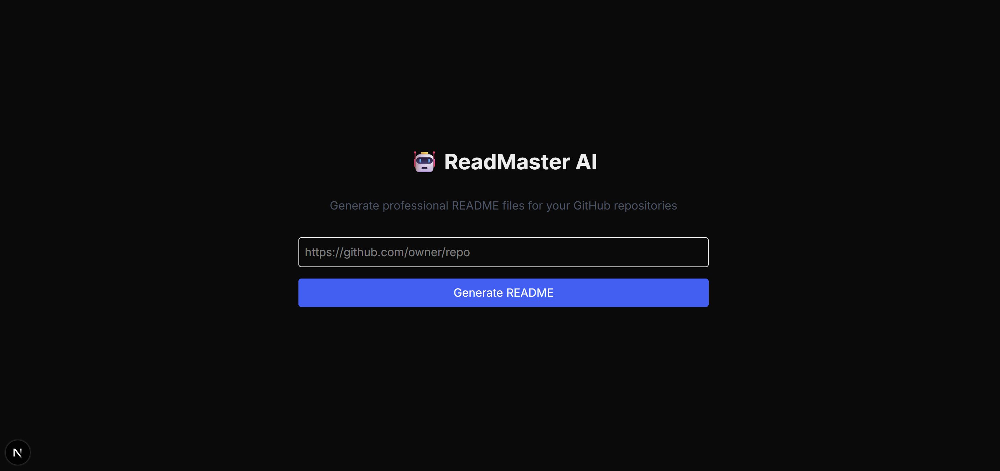

# 🚀 ReadMasterAI

**AI-Powered README Generator for Developers**

[](https://github.com/Mrudula1205/ReadMasterAI/stargazers)
[](https://github.com/Mrudula1205/ReadMasterAI/network/members)
[](https://github.com/Mrudula1205/ReadMasterAI)
[](LICENSE)

---

ReadMasterAI is an AI-powered web application that helps developers effortlessly generate professional, project-specific README files. With a modern, intuitive interface and live Markdown preview, ReadMasterAI streamlines the documentation process, allowing you to focus on building—while we handle the docs!

---

## 📚 Table of Contents

- [✨ Features](#-features)
- [🚀 Getting Started](#-getting-started)
  - [Prerequisites](#prerequisites)
  - [Installation](#installation)
- [🛠️ Usage](#️-usage)
- [📁 Project Structure](#-project-structure)
- [🤝 Contributing](#-contributing)
- [📄 License](#-license)
- [📊 Repository Statistics](#-repository-statistics)

---

## ✨ Features

- **AI-Powered README Generation**: Instantly generate detailed, professional README files tailored to your project.
- **Modern Web Interface**: Built with Next.js, React, and Tailwind CSS for a seamless user experience.
- **Live Markdown Preview**: See your README in real-time as you edit and generate.
- **Customizable Output**: Edit and refine the generated content before downloading.
- **API Endpoints**: Easily integrate README generation into your own workflows.
- **Supports Latest Tech Stack**: TypeScript, Tailwind CSS, and more.
- **Developer-Friendly**: Designed for ease-of-use and productivity.

---

## 🚀 Getting Started

### Prerequisites

- [Node.js](https://nodejs.org/) (v14 or higher recommended)
- [npm](https://www.npmjs.com/) (comes with Node.js)
- [Python](https://www.python.org/) (for backend AI integration)
- (Optional) [Git](https://git-scm.com/) for cloning the repository

### Installation

1. **Clone the repository:**

   ```bash
   git clone https://github.com/Mrudula1205/ReadMasterAI.git
   cd ReadMasterAI/ai-readme-generator
   ```

2. **Install frontend dependencies:**

   ```bash
   npm install
   ```

3. **Set up environment variables:**

   Create a `.env` file in `ai-readme-generator/` and add any required API keys or configuration (see `.env.example` if available).

4. **Start the development server:**

   ```bash
   npm run dev
   ```

   The app should now be running at [http://localhost:3000](http://localhost:3000).

5. **(Optional) Set up Python backend:**

   If required, ensure `ai_readme_creator.py` and dependencies are installed:

   ```bash
   pip install -r requirements.txt
   ```

---

## 🛠️ Usage

1. **Open the web app** in your browser at [http://localhost:3000](http://localhost:3000).
2. **Enter your project details** in the provided form (project name, description, tech stack, etc.).
3. **Click "Generate README"** to let the AI craft a custom README for your project.
4. **Preview and edit** the generated Markdown in real-time.
5. **Download or copy** the final README for your repository.

**Example:**

 <!-- Add actual screenshot if available -->

---

## 📁 Project Structure

```
ReadMasterAI/
│
├── ai_readme_creator.py                # Python backend for AI README generation
├── __pycache__/                        # Python bytecode cache
│
└── ai-readme-generator/                # Main web application (Next.js + React)
    ├── app/
    │   ├── api/
    │   │   └── generate-readme/        # API endpoints for README generation
    │   ├── favicon.ico
    │   ├── globals.css
    │   ├── layout.tsx
    │   └── page.tsx
    ├── public/                         # Static assets (SVGs, images)
    ├── .gitignore
    ├── README.md
    ├── next.config.ts
    ├── package.json
    ├── package-lock.json
    ├── postcss.config.mjs
    ├── tsconfig.json
    └── ...
```

---

## 🤝 Contributing

We welcome contributions from the community! To contribute:

1. **Fork** this repository.
2. **Create a new branch** for your feature or bugfix.
3. **Commit** your changes with clear messages.
4. **Push** to your fork and submit a **pull request**.

Please read our [contributing guidelines](CONTRIBUTING.md) (coming soon) for more details.

---

## 📄 License

This project currently does **not specify a license**. Please contact the repository owner for usage permissions.

---

## 📊 Repository Statistics

- **Stars:** 0
- **Forks:** 0
- **Primary Language:** Python (with Next.js/React frontend)
- **License:** Unspecified

---

> _Empower your projects with clear, professional documentation—generated in seconds with ReadMasterAI!_

---

[🔗 GitHub Repository](https://github.com/Mrudula1205/ReadMasterAI)
```
